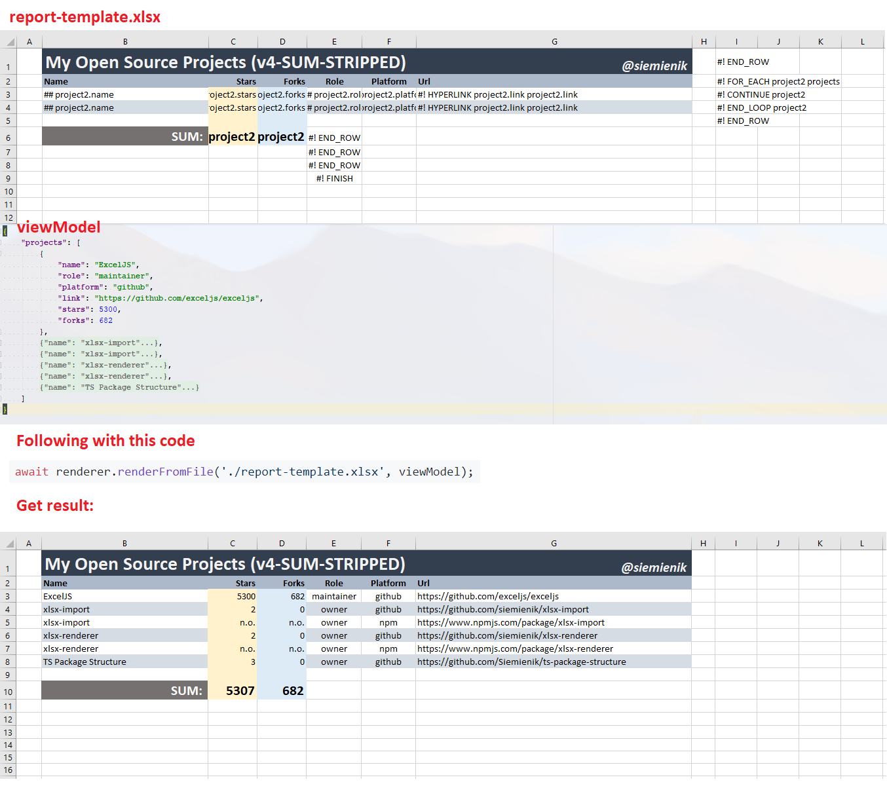

# XLSX-Renderer

  

_Github: [https://github.com/Siemienik/XToolset/.../xlsx-renderer](https://github.com/Siemienik/XToolset/tree/master/packages/xlsx-renderer)_

## Introduction

XLSX-Renderer is a JavaScript / TypeScript package specialized in generating Excel files with minimum code and maximum flexibility.
It satisfies both assumptions by using a template engine implemented by design. Thus you don't need to write tons of code to set up cells styles, fonts or borders, etc.
Instead of that, it is enough to create a template in MS Excel (or use another spreadsheet manager). Of course, it needs to follow some guidelines and syntax principles.
About that and how to customize the renderer, you can read more in the following sections of the documentation.

## Example use cases

1. **Are you feeling nervous when the business wants to change the invoice layout?**
   Now you may say "bye-bye" to changing thousands of line codes. It is enough to update `invoice-template.xlsx` and use with this tool.

2. **Do you need generate complex report?**
   Imagine that it willn't be terrible too much. Commonly generating files requires to write a lot of lines of code (for instance get cell A1, set font bold, border solid, test etc.). With this tool you may use Microsoft Excel to fancy create `complex-report-template.xlsx` and mix it with your data by using `xlsx-renderer`.

3. **Did the boss said that it is only a little change in `sales-report.xlsx`, but it isn't?**
   With `xlsx-renderer` you mustn't change any line of code, just update your `template.xlsx`

## How it works

It consumes a template file which is common Excel file, then add yours data called view model. Blend it and done, the output is the desirable file.

## Curriculum

Chapters included in this section:

1. [Installation Guide](./020-installation.md)
2. [Getting Started](./030-getting-started.md)
3. [Cells Explantations](./040-cells.md)
4. [Examples](./050-examples.md)
5. [Command line tool](./990-xlsx-renderer-cli-readme.md)

## Worth to know

* XLSX-Renderer is member of [XToolset](../xtoolset-readme.md),
* There is a possibility to import data from XLSX (also from generated) files, read more about [XLSX-Import](../xlsx-import-readme.md),
* GitHub repository: https://github.com/Siemienik/XToolSet.

### Support

If any help needed, just feel free to create a [discussions](https://github.com/Siemienik/XToolset/discussions/new). We will be really thankful for added links into stackoverflow topics if exists.

To report a bug please [create an issue](https://github.com/Siemienik/XToolset/issues/new).

We are ready to provide paid support or consulting, in order that please contact me: [hi@siemienik.com](mailto://hi@siemienik.com) or [support@siemienik.com](mailto://support@siemienik.com).

### Compatible with

| **TypeScript** | **JavaScript** | **NodeJS** | **React** | **Angular** | **Vue** |
|---|---|---|---|---|---|
|  |  |  |  |  |  |

#### ✅ NodeJS

|  10 |  11 |  12 |  13 |  14 | 15 | 16 | 17 |
|-----|-----|-----|-----|-----|----|----|----|
| 🟢 |  🟢 | 🟢 |  🟢 | 🟢 | 🟢 | 🟢 | 🟢 |

#### ✅ Browsers

|  Chrome |  Firefox |  Safari | 
|---------|----------|---------|
| 🟢 |  🟢 | 🟢 |

[**Topic about using XLSX-Renderer in a browse.r**](https://github.com/Siemienik/XToolset/issues/93#issuecomment-797835786).

### License

Whole XToolset is created by the community with [Siemienik's](https://github.com/Siemienik) leadership.

Many thanks to [all contributors](https://github.com/Siemienik/XToolset/graphs/contributors).

This software licensed by [MIT](https://github.com/Siemienik/XToolset/blob/master/LICENSE).
